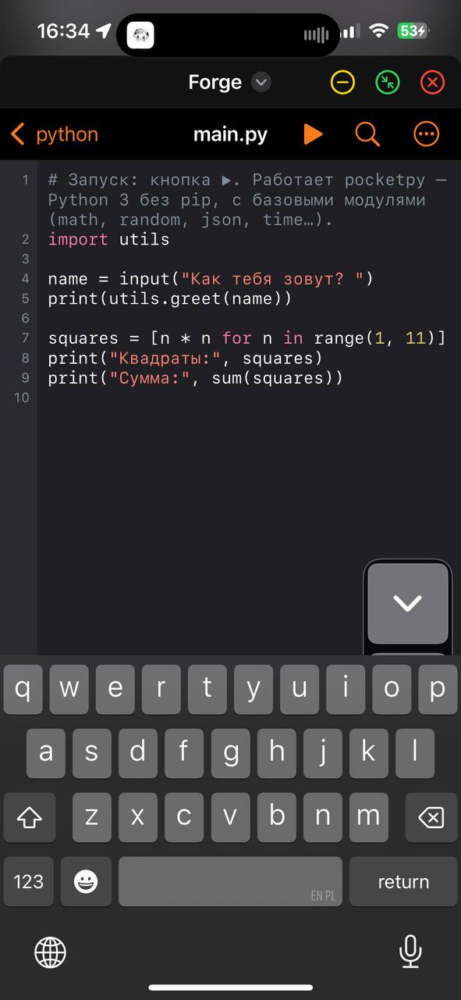
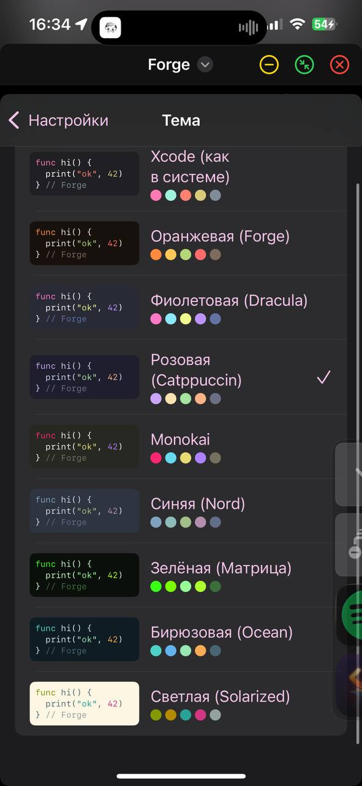
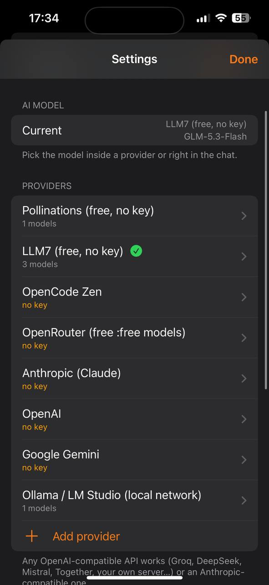

**English** · [Русский](README.ru.md)

# Forge — an IDE for iPhone and iPad

A code editor, an AI agent, script runners and GitHub right on your phone. Built on Linux with
[ipab](https://github.com/mezyqq/ios-compiler-for-linux) and installed through LiveContainer / iloader.

## Screenshots

<p>
  
  
  
</p>

## Building

```sh
~/ios-compiler-for-linux/ipab build ~/forge            # debug → ~/forge/build/Forge.ipa
~/ios-compiler-for-linux/ipab build ~/forge --release  # version +1 → ~/forge/releases/Forge-<version>.ipa
```

A release build bumps `VERSION`/`BUILD` in `ipa.conf`, removes the previous release and puts the new `.ipa` and the
`.map` symbol map (for decoding crash reports) into `releases/`. Update the app in LiveContainer by installing the new
`.ipa` over the old one — projects, keys and the GitHub token are kept.

## Features

- **Projects** in Documents (visible in the Files app): templates for Python, JavaScript, website, Lua, C and C++
  (console) and iOS apps (SwiftUI, Swift, ObjC, an ObjC game, ObjC++, C). Folder tree, file import, project-wide search, zip.
- **Editor**: highlighting for ~20 languages, themes (Xcode, orange, purple, pink, Monokai, Nord, Matrix, Ocean,
  Solarized), line numbers, find/replace, live syntax checking (Python, JS, Lua, C, JSON). With the built-in compiler, C / ObjC / C++
  files get real clang diagnostics, clang autocompletion with parameter placeholders (⇥ jumps to the next one) and
  clang-format (a `.clang-format` in the project root is respected).
- **Running without JIT**: Python (pocketpy), JavaScript (JavaScriptCore), Lua 5.4, C (picoc), live HTML preview.
  A console with input and a Stop button.
- **Native run with JIT** (compiler + JIT enabled for Forge): `.c`, `.cpp`, `.m` scripts are compiled by clang and
  run natively; an iOS project can be run right inside Forge without installing (see below).
- **Building .ipa on the phone**: C, Objective-C, C++ with the built-in clang + lld: a tappable list of errors, one-tap
  install into LiveContainer (see below).
- **AI agent** based on opencode's ideas: streaming, read/edit/write/glob/grep/list/run/build/todowrite/webfetch
  tools, forgiving replacement in edit, a task plan, loop protection, diagnostics after edits (clang for C-family
  code). `build` lets the agent build the app and fix compiler errors itself. Every file the agent touched can be
  reviewed as a diff and kept or reverted (the “Files changed” bar in the chat).
  Any provider: OpenAI-compatible and Anthropic. Free and without a key out of the box: Pollinations (default)
  and LLM7 (GLM-5.3-Flash, MiniMax-M2.7, Codestral).
- **GitHub** over the API (no git): clone, commit and push, pull changes, branches, history with diffs,
  pull requests, issues, publishing a project to a new repository. Sign-in with a Personal Access Token.
- **Preview window**: the `forge_preview()` screen (Run in Forge) can be minimized into a live draggable window over the
  editor, with a log panel (stdout/stderr, NSLog). Optional (Settings → Features, off by default): **live reload**
  (saving a source rebuilds and swaps the screen), **AI screenshots** of the preview (`screenshot` tool), **voice input**
  in the chat, **update check on launch**.
- **Pictures in the chat**: attach up to 4 photos to a message (the model must support images).
- **Tabs** of open files on iPad.
- **JIT status** (Settings → Native code): recognizes debugger-based JIT (StikDebug, SideStore, LiveContainer) and JIT
  that allows executable memory (e.g. Lara); a manual override for tools Forge cannot detect.
- **Other versions and data snapshots** (Settings → Updates): install any release, including rolling back. Before every
  version switch, projects (without `build/`) and settings are packed into an LZMA snapshot; coming back to a newer
  version offers to restore its data. Snapshots can be restored, shared or deleted; restoring saves the current state
  first. AI keys and the GitHub account live in the Keychain and are not affected.
- **Updates** (Settings → Updates): checks GitHub Releases, downloads the new `.ipa` and, inside LiveContainer, replaces
  Forge in place (LiveContainer's `LCAppInfo.plist` is kept, so projects, settings, keys and GitHub stay); then
  Restart → LiveContainer opens → tap Forge (LiveContainer re-signs it on that launch). Outside LiveContainer the
  `.ipa` is offered via Share. "Install in LiveContainer" after a build also works from inside LiveContainer now.
- **Crash log** (Settings → Debugging): a report with the version, stack and recent actions.
- **Interface language**: English by default, Russian in Settings → Language.

## Layout

```
forge/
  ipa.conf, Info.extra.plist   ipab config (frameworks, bridging header, symbol map, RELEASES)
  src/                         Swift (UI, agent, GitHub, editor) + C
    engines/                   interpreters: pocketpy, Lua 5.4.9, picoc (+ iOS patches) and the forge_engines.c glue
    forge_crash.c              crash handler (signals → report)
  res/icon.png, art/icon.svg   the icon and its source
  tools/symbolicate.sh         "Forge+0x…" from a report → function name
  compiler/                    separate repo ios-compiler: clang + lld for iOS (not part of Forge's git)
  releases/                    the latest release .ipa + .map
  THIRD_PARTY.txt              licenses of opencode, pocketpy, Lua, picoc
```

## Crash reports

Settings → Debugging → Crash log → report → Share. Decode it on the computer:

```sh
~/forge/tools/symbolicate.sh report.txt   # the map is taken from releases/ by the version in the report
```

## Compiler on the phone

The 🔨 button of an iOS project (one with `ipa.conf`) builds a C / Objective-C / C++ app into an `.ipa` right on the
phone: the built-in clang and lld from [ios-compiler](https://github.com/mezyqq/ios-compiler), with a trimmed iOS SDK
inside the bundle. Same `ipa.conf`, `src/`, `res/`, `Info.plist` as ipab; the result is `build/<NAME>.ipa`, then
Install in LiveContainer (Forge serves the `.ipa` on 127.0.0.1 and opens `livecontainer://install`), then Open, or Share.
Compiler errors are listed under the log — tap one to open the file at that line. Builds are incremental; the project
menu has "Build release" (version +1). Swift is not compiled on the phone — build such projects with ipab on a computer.

**Run in Forge (JIT, no install)** — project menu. The sources are compiled and linked straight into Forge's memory
(ORC JIT); this needs JIT enabled for Forge. If the project defines `UIViewController *forge_preview(void)`, that
screen is shown inside Forge (the ObjC and game templates have it); otherwise `main()` runs in the console.
Objective-C classes and selectors are registered, static constructors run; categories, `+load` and C++ exceptions
are not supported there.

For the compiler to be included in Forge, build it next to it (otherwise Forge is built without it):

```sh
git clone https://github.com/mezyqq/ios-compiler ~/forge/compiler
cd ~/forge/compiler && ./build-llvm.sh > build.log 2>&1 && make && make toolchain   # LLVM takes hours
```

## License

Forge is licensed under the GNU General Public License v3.0 — see [LICENSE](LICENSE).
Third-party code and its licenses: [THIRD_PARTY.txt](THIRD_PARTY.txt).
